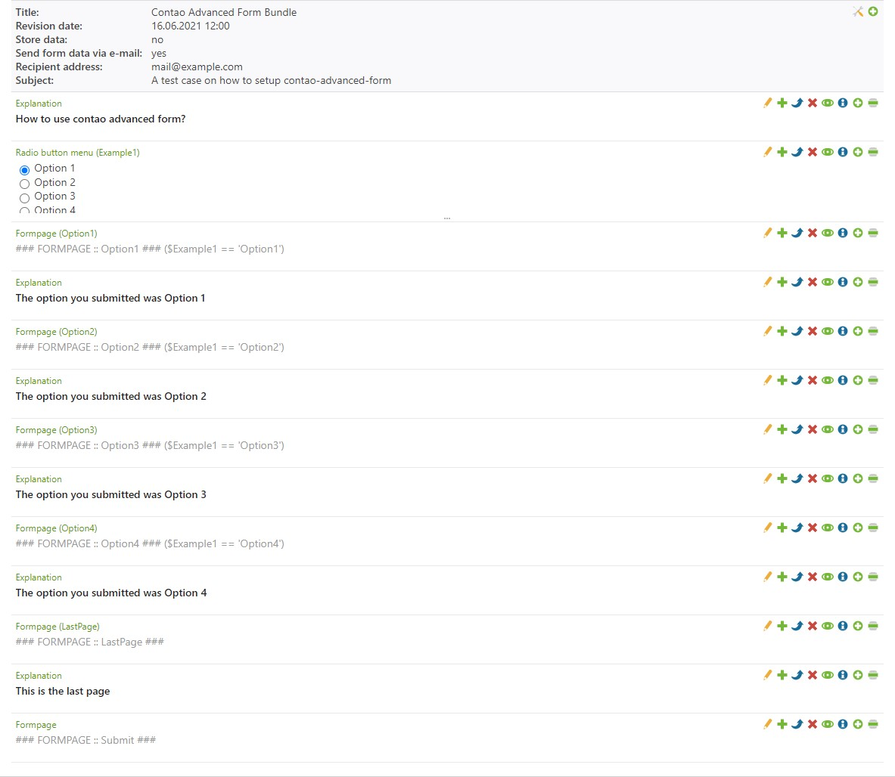
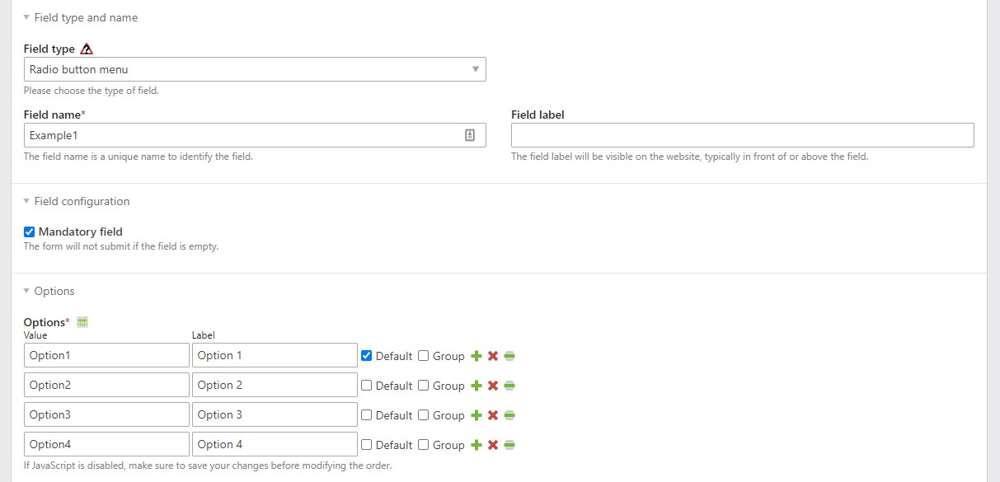
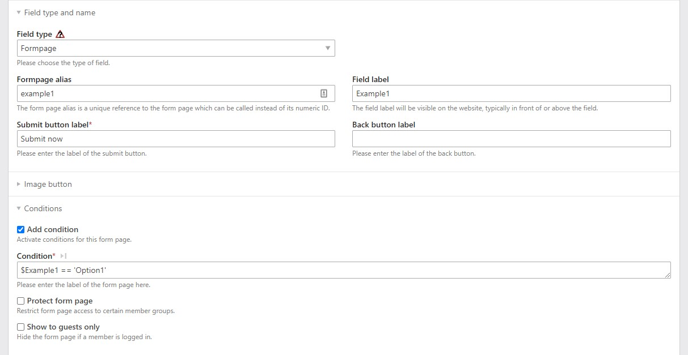

<p align="center">
    <a href="https://github.com/sponsors/oveleon"></a>
</p>
<h1 align="center">Contao Advanced Form</h1>
<p align="center"><i>The contao advanced form bundle adds a new form-field (Formpage) to forms that can be used for multipage-forms with conditions</i></p>
<p align="center">
    <a href="https://www.oveleon.de"></a>
    <a href="https://github.com/oveleon/contao-advanced-form"></a>
    <a href="https://packagist.org/packages/oveleon/contao-advanced-form"></a>
</p>
<br/>

---

## Support

If you like this extension, we'd love your support in keeping the open-source spirit alive.

If you think this plugin is useful, please consider [sponsoring us](https://github.com/sponsors/oveleon) to help
contribute to our time invested and to further development of this and other open source projects.

Your contributions, whether through `coding`, `testing`, `providing feedback`, or even
a [donation](https://github.com/sponsors/oveleon), help ensure that we can continue offering free open source software.
Join us in making a difference, and thank you for your support! - [Oveleon](https://www.oveleon.de).

[](https://github.com/sponsors/oveleon)

---

> Working with **Contao ^5.3**, install v.0.3 for legacy support (Contao 4.*)

---

+ [Features](#features)
+ [How to install](#how-to-install-the-package)
+ [How does contao advanced form work?](#how-does-contao-advanced-form-work)
+ [Initial setup](#initial-setup)
+ [Advanced setup for conditions](#advanced-setup-for-conditions)
+ [Important Information](#important-information)
+ [Options](#options)
+ [License](#license)
+ [Sponsoring](#sponsoring)

## Features

- Configurable formpage / pageswitch form-field with conditions for submitted values
- A Guest mode to show specific form pages for guests only
- Does not display form-pages when conditions are not met
- Sends all collected data on specific form page
- Compatible with all form-fields from contao

## How to install the package

Install the package by using following command:

```
composer require oveleon/contao-advanced-form
```

After installing the contao-advanced-form-bundle, you should run a contao install to add the new fields.

The extension cannot be used or installed at the same time
as [MP_Forms from Terminal24](https://github.com/terminal42/contao-mp_forms)

## How does contao advanced form work

Once the installation is complete, you will be able to use a new field type called "Formpage" within Contao Forms that
does act as a divider for created form fields (i.e.: radio button menu, textarea, etc.).

The 'formpage' form-field acts as a page-switch and you will be redirected to it if the condition from previous
submitted values is met.

## Initial setup

1. Set up your form as usual and create your form-fields


2. Create 'formpage' fields between the form-fields that should be divided into pages

   


3. Add a 'submit button label' into your form-page


4. In case you want a button to get to your previous page, add a 'back button label' as well

## Advanced setup for conditions

1. Follow the initial setup mentioned above


2. Create values that can be submitted (e.g. Radio button menu) above the form-page that should meet the condition

   


3. Activate the "Add condition" checkbox and write your condition into it

   

## Important Information

### Creating Form Pages

- The first form-page will always be divided by the first form-field and the first 'Formpage'-field.

- Following form-pages are created by wrapping them with 'Formpage'-fields.

- The last field in your form needs to be a 'Formpage'-field, otherwise it will show all form-fields (This is great to
  debug through your form).

### Conditions

> Conditions within page-switches (Formpages) will always work for the
>
> **FOLLOWING**
>
> form-fields up to the next page-switch (Formpage)

### Syntax

```
 ${Field name of radio button menu} == '{Value of radio button menu}'
```

A radio button menu with a field name of **'Example1'**, and a submitted value of **'Option1'** will jump to this
page-switch (form-page).

```
 $Example1 == 'Option1'
```

You are able to set up complex conditions to show a certain form-page.
The following PHP functions can be used within the condition:

- floatval
- strval
- intval
- in_array
- str_contains

If more functionality is needed, feel free to create a feature issue.

### Buttons

> The submit-button and back-button are set up for the
>
> **PREVIOUS**
>
> form-page. They will work for the form-fields above the page-switch (Formpage).

### Classes

> Classes will always be set for the
>
> **PREVIOUS**
>
> form-page. They will work for the form-fields above the page-switch (Formpage).

### Protecting and hiding form-pages

> Using the option *'protect form page'* and *'show to guests only'*, will always work for the
>
> **PREVIOUS**
>
> form-page. They will work for the form-fields above the page-switch (Formpage).
>

## Options

| Option                  | Description                                                                                |
|-------------------------|--------------------------------------------------------------------------------------------|
| **Submit button label** | This field will add a submit button to your form-page that can be named (Next page)        |
| **Back button label**   | This field will add a back button to your form-page that can be named (Previous page)      |
| **Add condition**       | This checkbox will activate conditions. Your conditions can be written into the text-field |
| **Protect form page**   | Restricts the form page to certain member groups                                           |
| **Show to guests only** | Hides the form page if a member is logged in                                               |

## License

This project is licensed under the AGPL-3.0 License — check  <a href="LICENSE">LICENSE</a> for more details.
